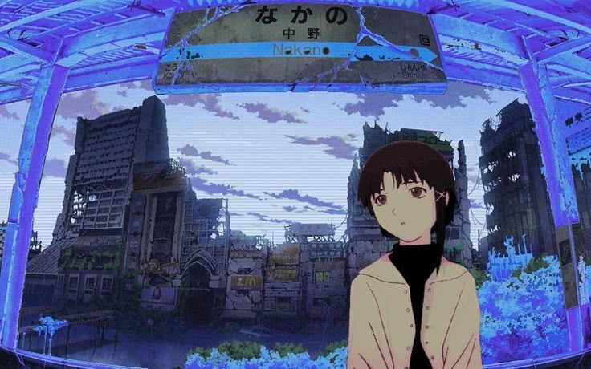

<!-- Banner -->

  

<h1 align="center">heyy, this is shristi</h1>
<h3 align="center">coffee.coffee.coffee.</h3>

  <a href="https://shristitapse.github.io/st/" target="_blank"><strong>Portfolio</strong></a> •
  <a href="www.linkedin.com/in/shristi-tapse" target="_blank"><strong>LinkedIn</strong></a>

---

### About Me

Aspiring AI engineer. Currently learning how things work before pretending I know how they work.
Interested in deep learning, LLMs, and building things that are actually useful.

---

### Languages and Tools

**Full Stack**

| JS | React | Node.js | MySQL |
|---|---|---|---|
|  |  |  |  |

**IoT**

| Arduino | Raspberry Pi |
|---|---|
|  |  |

**ML / AI**

| Python | PyTorch | TensorFlow | Hugging Face |
|---|---|---|---|
|  |  |  |  |

**Tools**

| Git | Linux | Docker |
|---|---|---|
|  |  |  |

---

> *"woman in stem"*
